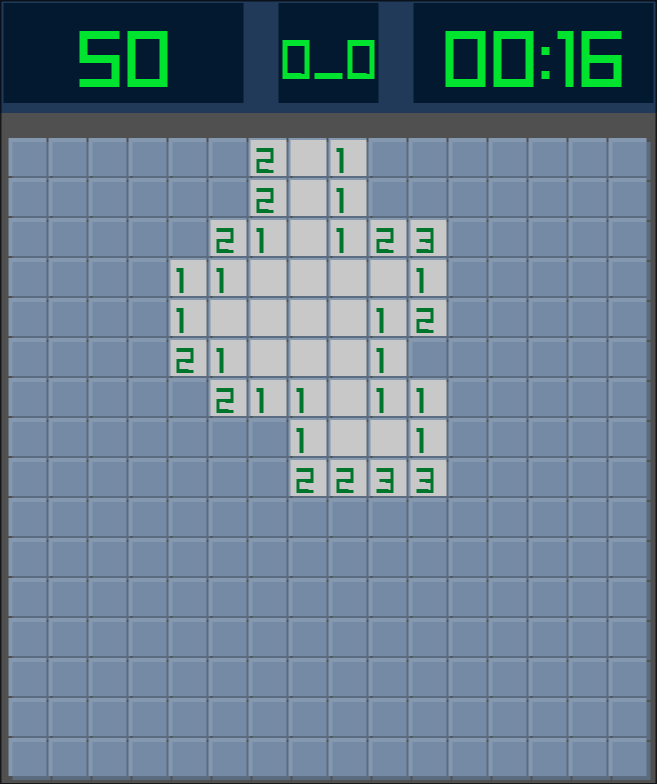
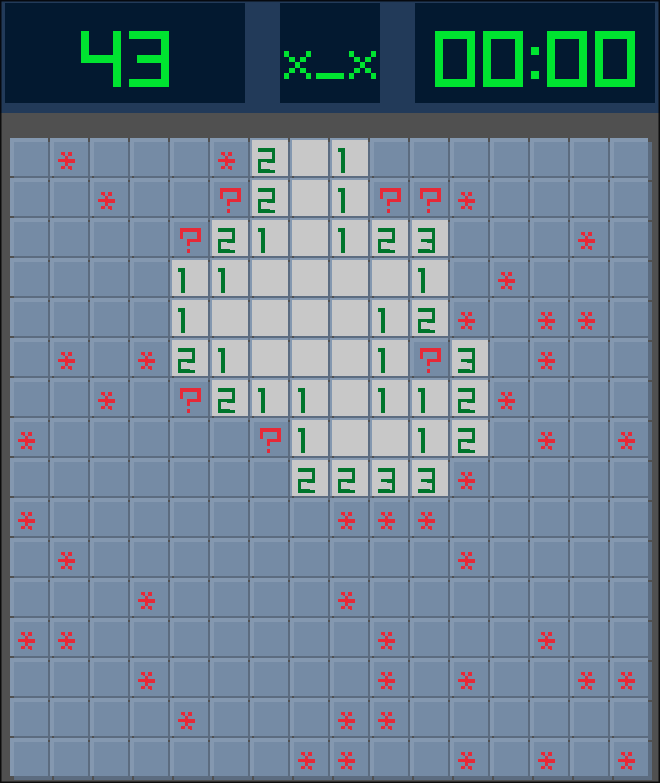
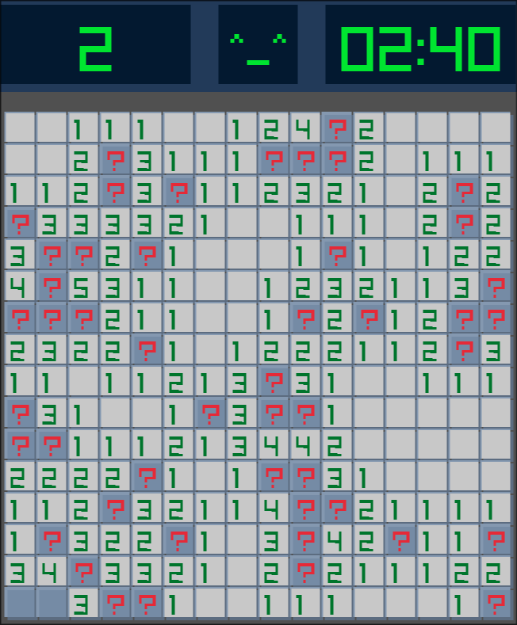

# Minesweeper Game in C++ Using Raylib
A simple 16x16 Minesweeper clone in C++ using Raylib. Click to reveal tiles, right click to flag, and use the face button to restart. First click is always safe. game shows a timer, remaining flags, and changes the face to “x_x” on loss or “^_^” on win.

## Showcase




## Requirements
- C++17(20, 24) compiler
- CMake 3.10
- Raylib

## Clone & Build
```bash
git clone https://github.com/Stone-r1/minesweeper.git 
cd minesweeper
mkdir build
cd build
cmake ..
make
./minesweeper
```
